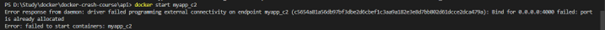

# **Docker**


## Dockerfile
```
##Each line below adds a new layer
##Dockerfile is to build image, which means we want to build an isolated working enviroment different from the current work environment

FROM node:17-alpine   
#get version 17 and alpine distribution of Linux, instead of the default distribution
#Can be helpful since we don't want to mess up everything when the default 
#distribution change(default distribution is always the latest version) 

WORKDIR /app
##Specify all the installations are under /app folder

COPY . .
#copy all the files in root directory to /app folder. 
#Since we have specified the workdir as /app, then the second "." means the /app directory

RUN npm install
#to install all the depentency in package.json in /app folder

EXPOSE 4000
# it is not necassary, only required for docker desktop port mapping

## don't write "RUN node app.js" since it is only the bulletpoint of the images.
## "RUN node app.js" should be run in container,但这里是镜像，就是instruction，而不是具体执行的地方
## Instead，用下面这句去指导接下来的container需要去 RUN node app.js
CMD ["node", "app.js"]

```


  

<br/><br/>

## 使用Docker caching优化代码

```
##Layer Caching
##如果修改了app.js的内容会影响COPY这一步，而copy之前的部分会从cache中获取，
##这样会节省时间，所以为了节省时间，我们可以把COPY往下移，这样COPY之前的都可以
##从Cache中获取，优化的方式如下：

FROM node:17-alpine   

WORKDIR /app

COPY package.json .
# ##需要先copy这个，因为只有基于这个文件，才能run npm install

RUN npm install

COPY . .
##如果仅有copy这步受到影响，则copy之前的会直接从cache中获取，节省时间

EXPOSE 4000

CMD ["node", "app.js"]


```

  

<br/><br/>

## 使用.dockerignore文件去ignore一些文件，不用copy进入container


<br/><br/>

## docker build

建立image的代码

```
docker build -t myapp .
##-t 表示要写名字为myapp
##最后的. 表示在当前目录下build

```

<br/><br/>

## container的使用

```
docker run --name myapp_c2 -p 4000:4000 -d myapp
##--name是myapp_c2
## -p 4000是网页端口，第二个4000是container端口
## -d 是运行的时候detach，而不是悬停在页面

```


没有-d


有-d


```
docker ps -a

#-a列出所有的container，没有-a列出正在in use的container

docker ps -aq

#q stands for quiet, 只会输出container id

docker start myapp\_c2

docker stop myapp\_c2

docker container rm myapp\_c2

docker container rm myapp\_c1 myapp\_c2

##remove two containers at the same time

docker rm (docker ps -aq)

##another way to remove container, 删除所有不在running的container
```

有时候会报错如下，其实是端口被别的container使用了




## Image的使用
```
docker images

##list all images

docker image rm myapp

##remove image myapp

docker image rm myapp -f

##remove image myapp force

docker rmi myapp5

##another way to remove image
```


## delete all images, containers, volumes


```
docker system prune -a

docker build -t myapp:v1 ./api

##build image myapp，并且标明这是版本1，v1
```


```
docker run --name myapp\_c -p 5000:4000 myapp:v1

##基于myapp:v1 建新的container
```


## Volumes

如果我们修改了app.js里头的内容，但是考虑到没有rebuild image, 那么继续运行image和container是不能反映app.js的变化的，这时候要不就是rebuild image, 要不就是用到volumes

Volumes can be useful for that directory mapping between the project in the local computer and the container so that we can see the changes without rebuilding the images.  
<br/><br/>  

### 1. 现在我们修改app.js的内容从：

'listening for requests on port 4000'

to

'listening for requests on port 4000......'
<br/><br/>

### 2. 修改app.js文件

```
FROM node:17-alpine   

RUN npm install -g nodemon
##修改了这句，-g表示global变量，nodemon用来global监控any change

WORKDIR /app

COPY package.json .

RUN npm install

COPY . .

EXPOSE 4000

CMD ["npm", "run","dev"]
##修改了这句，看下面注解


```

<br/><br/>

### 3. 修改package.json文件

注意：在package.json的dev处增加了nodemon -L app.js， -L是因为我的电脑是windows系统，必须加


<br/><br/>

### 4. rebuild image

```
docker build -t myapp:nodemon .
```

<br/><br/>

### 5. 新建一个container

```
docker run --name myapp_c_nodemon -p 5000:4000 --rm myapp:nodemon
## --rm表示只要docker stop myapp_c_nodemon, then myapp_c_nodemon will be deleted automatically
```

<br/><br/>

### 6. 如果app.js一直有改变，可以使用

```
docker run --name myapp_c_nodemon -p 5000:4000 --rm -v D:\Study\docker\docker-crash-course\api:/app myapp:nodemon
#-v 表示映射本地文件夹对应workdir（即/app）,目前暂时不work，以后看看

```
<br/><br/>

## Docker Compose

每次写docker build, docker run之类的语句不organized， 可以通过在根目录下写docker-compose.yaml文件去organize


```
version: "3.7"
# Compose file format is 3.8, 对应Docker version 19.03.0+
#https://docs.docker.com/compose/compose-file/compose-versioning/

services:
  api:
    build: ./api
    container_name: api_c
    ports: 
      - '4000:4000'
    volumes:
      - ./api:/app
      - ./app/node_modules

```

写完之后，在docker-crash-course这个根目录下运行下面代码即可自动生成images&container&volumes
```

docker-compose up
```


<br/><br/>

## 利用两个container分别控制前端后端


<br/><br/>

## 附录  

实验文件包括  


 
>>>>>>> 8f54ad4899c2ffdde761063ba3748161178614b8
